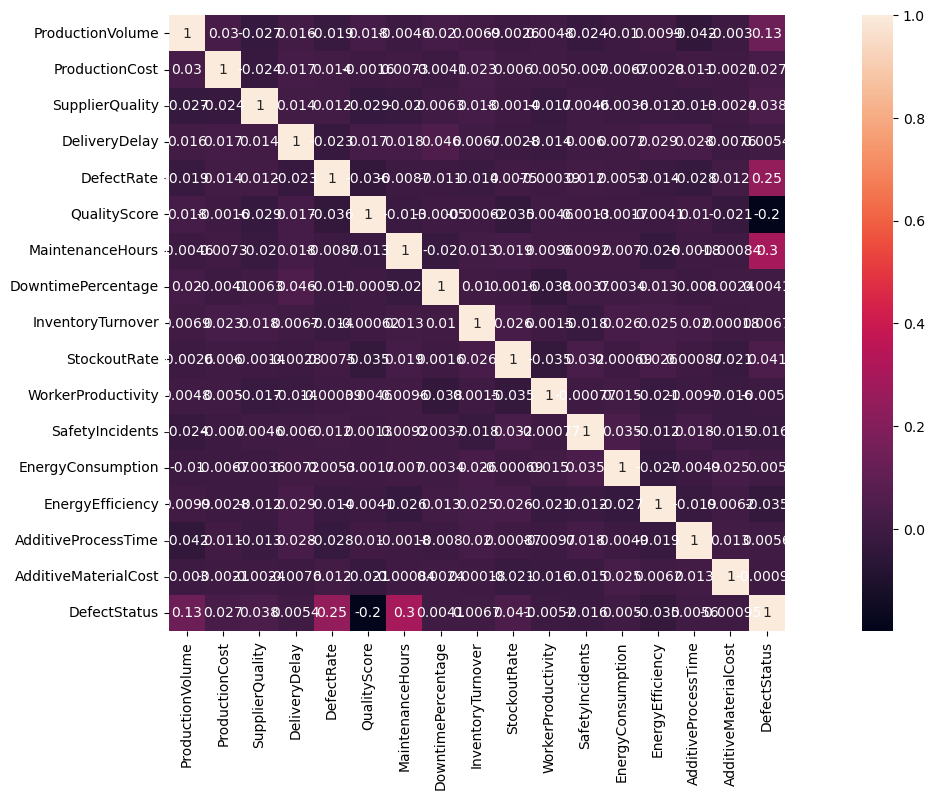

# Introduction

In this project we have data that provides insights into factors influencing defect rates in a manufacturing environment. Our task in this report is to make a Machine Learning model to predict high or low defect occurrences in production processes.

Let's begin with the description of the metrics of the dataset: 

## Variables Description
### Production Metrics
**ProductionVolume**: Number of units produced per day.

Data Type: Integer.

Range: 100 to 1000 units/day.

**ProductionCost**: Cost incurred for production per day.

Data Type: Float.

Range: $5000 to $20000.

### Supply Chain and Logistics
**SupplierQuality**: Quality ratings of suppliers.

Data Type: Float (%).

Range: 80% to 100%.

**DeliveryDelay**: Average delay in delivery.

Data Type: Integer (days).

Range: 0 to 5 days.

### Quality Control and Defect Rates
**DefectRate**: Defects per thousand units produced.

Data Type: Float.

Range: 0.5 to 5.0 defects.

**QualityScore**: Overall quality assessment.

Data Type: Float (%).

Range: 60% to 100%.

### Maintenance and Downtime
**MaintenanceHours**: Hours spent on maintenance per week.

Data Type: Integer.

Range: 0 to 24 hours.

**DowntimePercentage**: Percentage of production downtime.

Data Type: Float (%).

Range: 0% to 5%.

### Inventory Management
**InventoryTurnover**: Ratio of inventory turnover.

Data Type: Float.

Range: 2 to 10.

**StockoutRate**: Rate of inventory stockouts.

Data Type: Float (%).

Range: 0% to 10%.

### Workforce Productivity and Safety
**WorkerProductivity**: Productivity level of the workforce.

Data Type: Float (%).

Range: 80% to 100%.

**SafetyIncidents**: Number of safety incidents per month.

Data Type: Integer.

Range: 0 to 10 incidents.

### Energy Consumption and Efficiency
**EnergyConsumption**: Energy consumed in kWh.

Data Type: Float.

Range: 1000 to 5000 kWh.

**EnergyEfficiency**: Efficiency factor of energy usage.

Data Type: Float.

Range: 0.1 to 0.5.

### Additive Manufacturing
**AdditiveProcessTime**: Time taken for additive manufacturing.

Data Type: Float (hours).

Range: 1 to 10 hours.

**AdditiveMaterialCost**: Cost of additive materials per unit.

Data Type: Float ($).

Range: $100 to $500.

### Target Variable
**DefectStatus**: Predicted defect status.

Data Type: Binary (0 for Low Defects, 1 for High Defects).

# Results of the Analysis
According with the Correlation Matrix:

We can see a strong correlation with the `DefectStatus` 